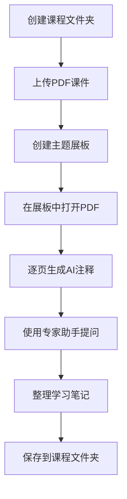
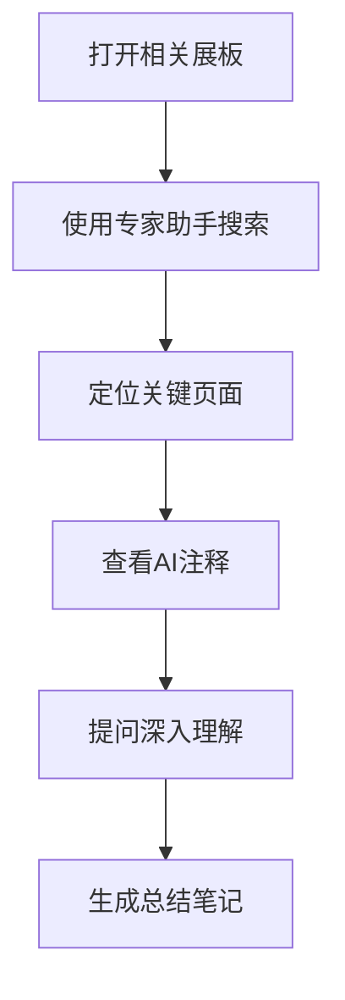
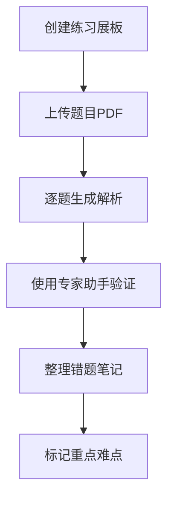

# WhatNote 快速入门指南

## 🎯 5分钟上手WhatNote

### 第一步：启动应用 (1分钟)

#### 方法一：使用启动脚本（推荐）
1. 双击 `启动WhatNote.bat` 文件
2. 等待自动检查环境和启动服务
3. 浏览器会自动打开主界面

#### 方法二：手动启动
```bash
# 在项目目录下运行
python main.py
```
然后访问：`http://127.0.0.1:8000/frontend_debug.html`

### 第二步：创建第一个课程 (1分钟)

```
📁 主界面布局：
┌─────────────────┬─────────────────┐
│   课程文件夹     │     展板区域     │
│                │                │
│ [+ 新建课程]    │  [+ 新建展板]   │
│                │                │
│ 📚 高等数学     │  📋 学习笔记1   │
│ 📚 线性代数     │  📋 练习题      │
│ 📚 概率论       │  📋 总结        │
└─────────────────┴─────────────────┘
```

**操作步骤：**
1. 点击左侧 **"+ 新建课程"**
2. 输入课程名称，如："高等数学"
3. 点击确认创建

### 第三步：上传PDF课件 (1分钟)

1. 点击课程文件夹右侧的 **"+"** 按钮
2. 选择 **"上传PDF"**
3. 选择你的PDF文件
4. 等待系统自动处理（会显示进度）

### 第四步：创建学习展板 (1分钟)

1. 点击右侧 **"+ 新建展板"**
2. 输入展板名称，如："第一章-极限"
3. 选择所属课程
4. 点击创建

### 第五步：开始AI学习 (1分钟)

#### 在展板中打开PDF
- 从左侧拖拽PDF文件到展板中
- 或点击PDF文件选择"在展板中打开"

#### 生成AI注释
```
PDF页面显示：
┌─────────────────────────────┐
│        PDF内容显示          │
│                            │
│     [上一页] 1/20 [下一页]   │
│                            │
│ [生成AI注释] [视觉识别注释]  │
│ [改进注释]   [保存笔记]     │
└─────────────────────────────┘
```

1. 浏览到需要注释的页面
2. 点击 **"生成AI注释"** 按钮
3. 等待AI分析并生成注释

#### 使用专家助手
```
专家助手面板：
┌─────────────────────────────┐
│ 💬 专家助手                  │
│ ┌─────────────────────────┐ │
│ │ 请解释第5页的核心概念    │ │
│ └─────────────────────────┘ │
│ [智能分析] [普通问答]        │
│                            │
│ 📝 回答显示区域...          │
└─────────────────────────────┘
```

1. 在展板右下角找到专家助手面板
2. 输入问题，如："请解释这个公式"
3. 点击 **"智能分析"** 获得详细回答

## 🎨 界面功能说明

### 主界面区域划分

```
完整界面布局：
┌─────────────────────────────────────────────────────────┐
│ 🏠 WhatNote | 🔍 搜索框 | 💬 智能助手 | ⚙️ 设置 | 📊 状态  │
├─────────────────┬───────────────────────────────────────┤
│   📁 课程管理    │           📋 展板工作区                │
│                │                                      │
│ 📚 课程文件夹1   │  ┌─────────┐  ┌─────────┐           │
│   📄 文件1.pdf  │  │ PDF窗口 │  │ 笔记窗口 │           │
│   📄 文件2.pdf  │  │         │  │         │           │
│                │  └─────────┘  └─────────┘           │
│ 📚 课程文件夹2   │                                      │
│   📄 文件3.pdf  │  ┌─────────────────────────────────┐ │
│                │  │        💬 专家助手面板          │ │
│ [+ 新建课程]    │  └─────────────────────────────────┘ │
└─────────────────┴───────────────────────────────────────┤
│                    📊 状态栏 | 🔧 工具栏                │
└─────────────────────────────────────────────────────────┘
```

### 核心功能按钮

| 按钮 | 功能 | 位置 |
|------|------|------|
| 📚 + 新建课程 | 创建课程文件夹 | 左侧课程区域 |
| 📋 + 新建展板 | 创建学习展板 | 右侧展板区域 |
| 📤 上传PDF | 上传课件文件 | 课程文件夹右键菜单 |
| 🤖 生成AI注释 | 自动生成页面注释 | PDF窗口底部 |
| 👁️ 视觉识别注释 | 图像识别生成注释 | PDF窗口底部 |
| ✨ 改进注释 | 优化现有注释 | PDF窗口底部 |
| 🧠 智能分析 | MCP专家系统分析 | 专家助手面板 |

## 🚀 常用操作流程

### 📖 学习新章节流程



### 🔍 复习知识点流程



### 📝 做题练习流程



## 💡 使用技巧

### 🎯 高效注释策略

| 页面类型 | 推荐方法 | 说明 |
|----------|----------|------|
| 纯文字页面 | 生成AI注释 | 快速理解文字内容 |
| 包含图表 | 视觉识别注释 | 识别图表和公式 |
| 复杂概念 | 先生成后改进 | 基础注释+深度解析 |
| 练习题 | 专家助手分析 | 获得解题思路 |

### 🤖 专家助手提问技巧

**好的提问示例：**
- ✅ "请详细解释第5页的微分定义，并举个实际例子"
- ✅ "这个公式在什么情况下使用？有什么限制条件？"
- ✅ "帮我总结这一章的核心知识点，并列出重点公式"

**避免的提问方式：**
- ❌ "这是什么？"（太模糊）
- ❌ "帮我做作业"（缺乏具体指向）
- ❌ "解释一下"（没有明确对象）

### 📊 学习进度管理

1. **按章节创建展板**：每个章节一个专门展板
2. **使用标签分类**：理论、练习、总结、疑问
3. **定期整理笔记**：使用管家助手整理文件结构
4. **建立知识图谱**：关联相关概念和公式

## 🔧 故障排除

### 常见问题快速解决

| 问题 | 症状 | 解决方案 |
|------|------|----------|
| 无法生成注释 | 点击按钮无反应 | 检查API密钥配置 |
| PDF上传失败 | 上传进度卡住 | 检查文件大小和格式 |
| 专家助手无响应 | 提问后无回复 | 刷新页面重试 |
| 界面显示异常 | 布局错乱 | 清除浏览器缓存 |

### 🆘 获取帮助

1. **查看控制台**：按F12打开开发者工具查看错误
2. **检查服务状态**：访问 `http://127.0.0.1:8000/health`
3. **查看日志文件**：检查 `logs/` 目录下的日志
4. **重启服务**：关闭后重新运行启动脚本

## 🎓 学习建议

### 📚 适合的学习场景

- **理工科课程**：数学、物理、工程类课程
- **文科课程**：历史、文学、法律等需要大量阅读的课程
- **考试复习**：整理知识点、生成复习材料
- **论文研究**：分析参考文献、整理研究资料

### 🎯 最佳实践

1. **循序渐进**：先熟悉基础功能，再使用高级特性
2. **合理分类**：按课程、章节、难度等维度组织内容
3. **及时整理**：定期清理和归档学习材料
4. **善用AI**：充分利用AI注释和专家助手功能
5. **记录疑问**：遇到问题及时记录，便于后续解决

记住：WhatNote是你的智能学习伙伴，善用它的AI能力可以让学习事半功倍！🚀 